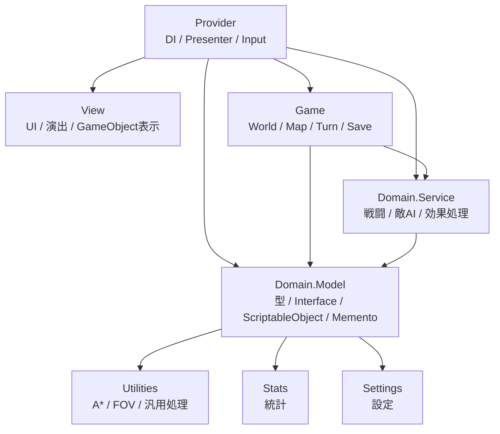

# LogRogue Architecture

[READMEへ戻る](../README.md)

LogRogue では、ゲームルール、進行管理、表示、入力、データ定義を分離し、依存方向が大きく崩れないように Assembly Definition で制限しています。

基本方針は、**データ定義やインターフェースを内側に置き、外側の実装が内側の定義に依存する**構造です。

---

## Layer Overview

`Provider` は、DI や Presenter を通じて各層を接続する合成ルートです。  
`View` は UI、演出、GameObject の表示制御を担当します。  
`Game` は World、Map、Turn、Save など、ゲーム全体の進行を管理します。  
`Domain.Service` は、戦闘、敵AI、効果処理、マップ処理などのゲームルールを実装します。  
`Domain.Model` は、型、インターフェース、ScriptableObject、Memento などのデータ定義を持ちます。  
`Utilities`、`Stats`、`Settings` は、複数の層から利用される共通基盤です。

---

## Dependency Policy

依存方向は Assembly Definition によって制限しています。

特に、次のような依存を避けています。

- `Domain.Model` が `Game` や `View` を参照しない
- `Domain.Service` が `GameObject` や UI に依存しない
- `Game` が `View` を直接操作しない
- `View` が `Domain.Model`、`Domain.Service`、`Game`、`Provider` に直接依存しない

これにより、敵AI、効果処理、ターン進行などの中核ロジックが、Unity の表示処理や UI に引きずられないようにしています。

---

## Provider as Composition Root

`Provider` は、入力、Presenter、DI コンテナなどを通じて、`View`、`Game`、`Domain.Service`、`Domain.Model` を接続する層です。

VContainer を使い、GameManager、Presenter、デバッグコマンドなどを登録・注入しています。

この層に接続処理を集めることで、各機能が互いに直接参照しすぎないようにしています。

主な実装：

- [Container.cs](../Assets/Scripts/Provider/Container.cs)

---

## Event Propagation and Dependency Inversion

LogRogue では、状態変化の通知に R3 を使っています。

ゲーム中には、次のような状態変化が頻繁に発生します。

- ターンの進行
- マップの切り替え
- 視界範囲の変化
- エンティティの追加・削除
- HP や状態異常の変化
- 好感度や所属の変化

これらを各クラスが直接呼び合う形で実装すると、  
ロジック側が表示側や具体的な更新処理を知る必要があり、依存関係が広がりやすくなります。

そこで、ロジック側は状態変化をイベントストリームとして公開し、  
Presenter や View 同期側が必要なイベントを購読して追従する形にしています。

これにより、例えば `Game` や `Domain.Service` は  
「UIを更新する」「特定のGameObjectを動かす」といった処理を直接呼ばずに済みます。

つまり R3 は、単なるイベント通知のためだけでなく、  
**ロジック側が表示側の具体的な実装を知らないまま状態変化を伝えるための仕組み**  
として使っています。

この構成により、依存関係を内側へ向けつつ、表示更新や演出側の処理を外側で購読できるようにしています。

---

## View Synchronization

View は、UI や演出、GameObject の表示制御に集中し、ゲームルールやデータ構造へ直接依存しないようにしています。

表示更新に必要な情報は、Presenter や同期用の仕組みを通じて View に渡します。

これにより、例えば敵AIやアイテム効果の実装を変更しても、表示側へ変更が広がりにくくなります。

主な実装：

- [SynchronizedEntityView.cs](../Assets/Scripts/Provider/SynchronizedView/SynchronizedEntityView.cs)

---

## Difficulties and Design Choices

### 1. Unity の GameObject へ依存しすぎないこと

Unity では、MonoBehaviour や GameObject を中心に実装すると、ロジックと表示が密結合になりやすいです。

しかしローグライクでは、敵AI、視界計算、効果処理など、表示に依存しないロジックが多くあります。

そのため、ゲームルールはできるだけ `Domain.Service` や `Game` 側に置き、  
`View` は表示と演出に集中させるようにしました。

### 2. 分離しすぎによる実装コスト

層を細かく分けすぎると、個人開発では中間層や変換処理が増えすぎる問題があります。

そのため、すべてを理想的に抽象化するのではなく、  
`Provider` に接続処理を集めることで、依存関係を整理しつつ実装コストを抑えています。

### 3. データ駆動と型安全性の両立

アイテム、敵、スキル、フロア設定は ScriptableObject や専用エディタから調整できるようにしています。

一方で、スキルや効果は種類が多く、単純な enum や固定クラスだけでは拡張しにくくなります。

そのため、`SerializeReference` を使い、効果、範囲、発生位置などをポリモーフィックに組み合わせられるようにしています。

これにより、データ側で試作しやすくしつつ、コード側では共通インターフェースを通じて処理できるようにしています。
